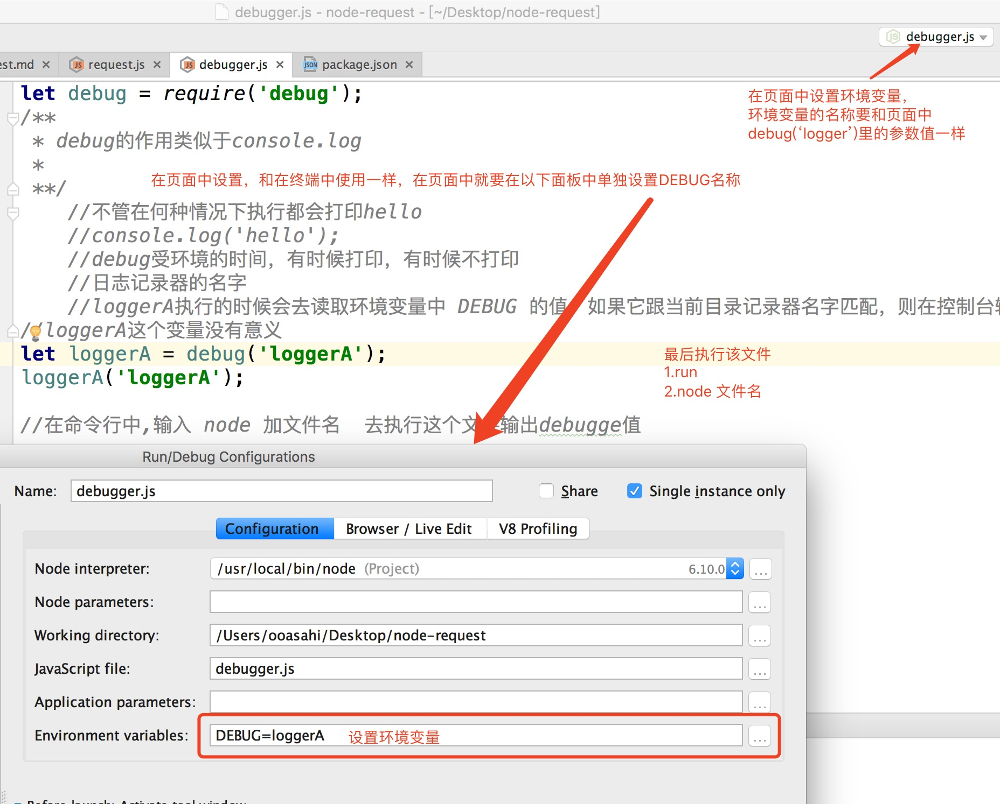

Unicode全球统一编码

## 环境变量
- 在命行中
    - window
    - 设置环境变量
    - SET DEBUG=loggerA
    - echo %DEBUG%

    - mac
    - 设置环境变量
    - DEBUG名字可以更改
    - export DEBUG=loggerA
    - echo $DEBUG
    
- 页面中

